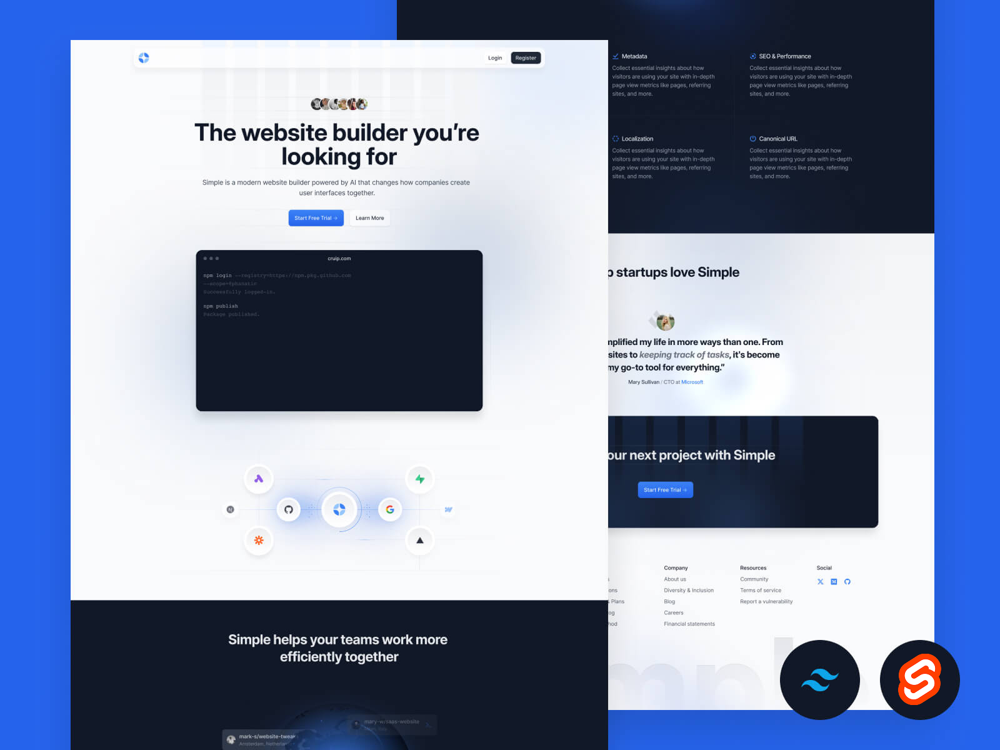

<div align="center">
  
  <h1>Simple - SvelteKit Landing Page Template</h1>

  <p>
    <a href="https://kit.svelte.dev">
      
    </a>
    <a href="https://tailwindcss.com">
      
    </a>
    <a href="https://opensource.org/licenses/MIT">
      
    </a>
  </p>
  
  <p>
    <strong>A modern, high-performance landing page template ported from <a href="https://github.com/cruip/tailwind-landing-page-template/">Cruip's Simple Next.js template</a>.</strong>
  </p>
</div>

Live : https://svelte-landing-page.netlify.app/

<br />

This project demonstrates how to build a production-ready landing page using **SvelteKit**, **Svelte 5 Runes**, and **Tailwind CSS v4**.

> **Note:** This project was originally prepared for **Next.js** and has been adapted to **SvelteKit**.

## Features

-   **Framework**: [SvelteKit](https://kit.svelte.dev/) (File-based routing, SSR/SSG).
-   **Reactivity**: Built with **Svelte 5 Runes** (`$props`, `$state`, etc.) for fine-grained reactivity.
-   **Styling**: [Tailwind CSS v4](https://tailwindcss.com/) (Oxide engine, CSS-first configuration).
-   **Animations**: [AOS](https://michalsnik.github.io/aos/) (Animate On Scroll) integration for smooth reveal effects.
-   **Architecture**:
    -   Component-based UI (`src/lib/components`).
    -   Route groups for Authentication layouts (`src/routes/(auth)`).
    -   Modular CSS organization.
-   **Performance**: Optimized image loading and minimal client-side JS.

## Tech Stack

-   **SvelteKit**: Web application framework.
-   **Tailwind CSS v4**: Utility-first CSS framework (configured via `@tailwindcss/vite`).
-   **Vite**: Next-generation frontend tooling.
-   **AOS**: Scroll animations.

## Project Structure

```bash
src/
├── lib/
│   └── components/     # UI Components (Hero, Features, Header, etc.)
├── routes/
│   ├── (auth)/         # Auth routes (signin, signup, reset-password) with dedicated layout
│   │   ├── +layout.svelte
│   │   └── ...
│   ├── +layout.svelte  # Main Layout (Header, Footer)
│   ├── +page.svelte    # Landing Page
│   └── layout.css      # Global Styles & Tailwind Imports
└── app.html            # HTML Shell
```

## Getting Started

1.  **Clone the repository**:
    ```bash
    git clone https://github.com/YusufCeng1z/sveltekit-tailwind-landing-page-template.git
    cd sveltekit-tailwind-landing-page-template
    ```

2.  **Install dependencies**:
    ```bash
    npm install
    ```

3.  **Start the development server**:
    ```bash
    npm run dev
    ```

4.  **Build for production**:
    ```bash
    npm run build
    ```

## Customizing

-   **Theming**: Edit `src/routes/additional-styles/theme.css` to update CSS variables and fonts.
-   **Components**: Reusable UI blocks are located in `src/lib/components`.
-   **Auth Layout**: The authentication layout is isolated in `src/routes/(auth)/+layout.svelte`.

## Credits

-   Original Design & Next.js Template by [Cruip](https://cruip.com/).
-   Ported to SvelteKit by Yusuf Cengiz.

## License

This project is open-source and available under the MIT License.
